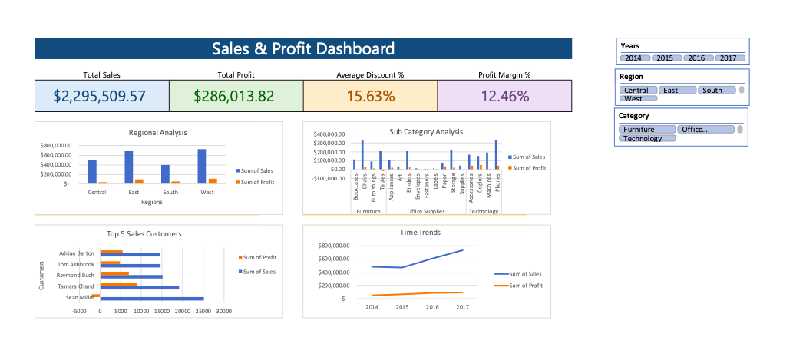

# Excel Superstore Dashboard

## Overview

This project showcases an **interactive Excel dashboard** built using the Superstore dataset.
The dashboard provides insights into **sales, profit, product performance, and regional analysis**.

---

## Project Structure

```text
excel-superstore-dashboard/
│── Dashboard.xlsx           # Only dashboard visible, data & pivots hidden
│── Dataset/
│   ├── raw_superstore.csv   # Original Kaggle dataset
│   └── cleaned_superstore.csv # Cleaned dataset used in the dashboard
│── Screenshot/
│   └── dashboard.png        # Screenshot of the dashboard
│── README.md


---

## Dataset

* **Raw Data:** `Dataset/raw_superstore.csv`

  * Original dataset downloaded from Kaggle.
* **Cleaned Data:** `Dataset/cleaned_superstore.csv`

  * Preprocessed version ready for analysis.
  * Sheet name inside Excel (if saved as `.xlsx`): `CleanedData`.

---

## Dashboard Features

* **Key Metrics (KPIs):** Total Sales, Total Profit, Average Discount %, and Profit Margin %
* **Regional Analysis:** Sales and profit comparison across Central, East, South, and West regions
* **Sub-Category Analysis:** Performance breakdown by furniture, office supplies, and technology sub-categories
* **Top 5 Customers:** Ranking by sales and profit contribution
* **Time Trends:** Year-wise sales and profit trends (2014–2017)
* **Interactive Filters:** Slicers for year, region, and category

---

## How to View

1. Open `Dashboard.xlsx` in Excel.
2. All underlying data and pivot tables are hidden for a clean view.
3. Use slicers and dropdowns to interact with the dashboard.

---

## Screenshot



---

## Notes

* Dashboard built in Excel 2016+ (Mac & Windows compatible).
* Data cleaning steps performed in Excel before creating pivot tables.
* For any modifications, refer to the cleaned dataset in `Dataset/cleaned_superstore.csv`.

---

## Author

Raj Vinnakota
